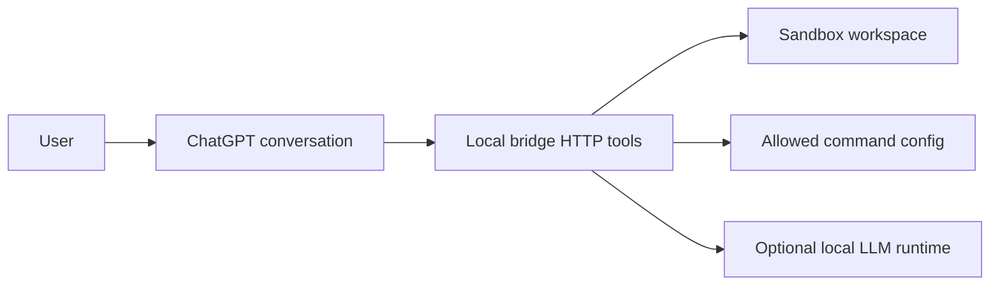

# Architecture

`chatgpt-local-agent-bridge` is a small local HTTP service intended to sit between a ChatGPT conversation and a user's own PC.

## Components

1. ChatGPT conversation
   - The user asks for work to be coordinated.
   - ChatGPT decides which bridge endpoint to call.
   - ChatGPT remains the interface and orchestrator.

2. Local bridge
   - Runs on loopback by default.
   - Requires bearer-token authentication by default.
   - Exposes only narrowly scoped tools.

3. Sandbox workspace
   - File tools are restricted to `LOCAL_BRIDGE_WORKSPACE`.
   - Absolute paths and path traversal are rejected.
   - Credential-looking filenames are hidden from listings.

4. Command allowlist
   - Commands are loaded from `config/allowed_commands.example.json` or another configured JSON file.
   - The bridge runs exact command IDs only.
   - Commands use `spawn` with `shell: false`.

5. Optional local LLM runtime
   - LM Studio can be used through an OpenAI-compatible local URL.
   - The MVP uses placeholder configuration and does not require paid API calls.

## Request Flow

## Persistence

The MVP stores submitted tasks in memory only. Restarting the bridge clears task status.

## Non-Goals

- arbitrary shell access
- full filesystem access
- browser profile access
- credential extraction
- public hosting
- autonomous background operation without user supervision
